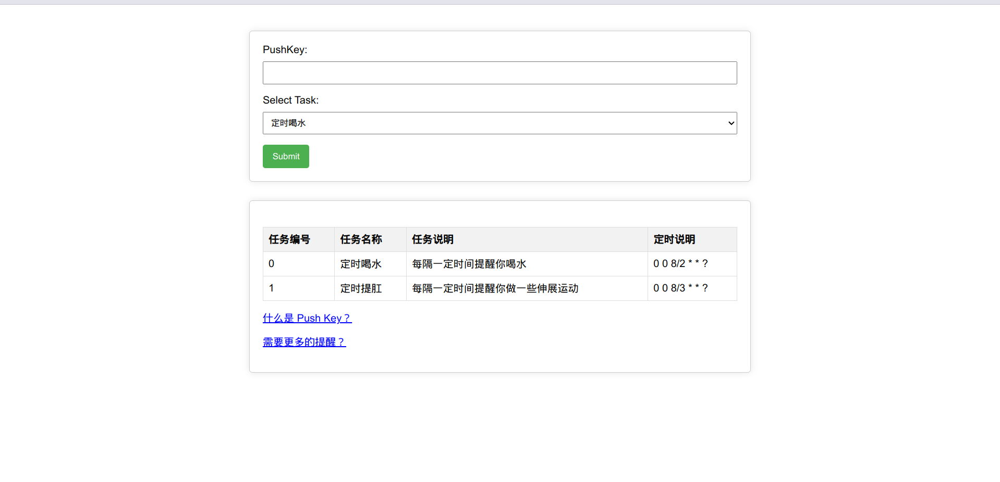

    <h1>NotificationTools</h1>
    
A PushDeer based push tool

    

## 描述
1. 基于[pushdeer](https://github.com/easychen/pushdeer) 的推送
2. 内置推送任务
3. 写着玩
4. 定时任务用的 `ThreadPoolTaskScheduler`

## 部署
先自行打包jar跑吧，等有空写个外置配置文件

## api文档
等有空接个swagger

## Todo
- [ ] 实现自定义消息
- [x] 糊一个前端
- [ ] 增加推送选项
- [ ] 自定义推送接口

## 其他
欢迎pr